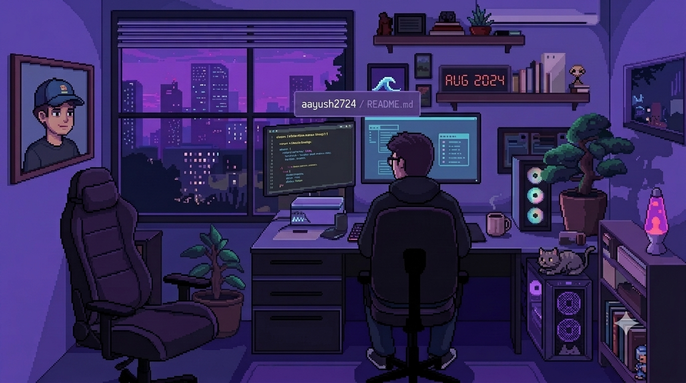

 

 

### 👋 About Me

- 🎓 3rd-year B.E. CSE (AI & ML) student, NIE Mysore — CGPA 9.3/10
- 🛡️ President, **OWASP NIE Student Chapter**
- 🔨 Currently building **Beatzy** — a music intelligence SaaS with real-time audio fingerprinting
- 🤖 Recently shipped **Auralis**, an AI sales bot that reached the top 200/8,700+ teams at Innovac
- 🏆 **LeadForge** (AI B2B lead pipeline) placed 3rd at ThinkRoot xVertex '26, an NIT Trichy hackathon
- ⚡ I believe in **building fast and shipping faster**
- 🧠 Always exploring new codebases, fresh project ideas, and AI-native tools
- 📫 Open to remote internships, freelance work, and interesting collaborations
- 🌐 Portfolio: [aayush-2724.vercel.app](https://aayush-2724.vercel.app)

 

### 🏆 Hackathons & Achievements

- 🥉 **LeadForge / P95.AI Lead Engine** — 3rd place, ThinkRoot xVertex '26 (NIT Trichy)
- 🤖 **Auralis** — Top 200 of 8,700+ teams, Innovac hackathon grand finale
- ⚙️ **FactorySense AI** — HACKFINIX 2026
- 🛣️ **RoadSoS** — National Road Safety Hackathon 2026
- 📱 **Phantom Memory** — Samsung ennovateX AX Hackathon
- ⛓️ **ProvenanceChain** — blockchain hackathon
- 🚧 Building an agentic AI system for government scheme discovery at **DSU DEVHACK 3.0** (Sept 2026)

 

### 🧮 Competitive Programming

- 725+ problems solved across graphs, DP, and advanced data structures — primarily in C++
- Active on LeetCode Weekly Contests — see live stats on [LeetCode](https://leetcode.com/aayush2724)

 

### 💻 Tech Stack

 

 

 

**Tools & DevOps**

 

 

### 🚀 Featured Projects

<b>🎵 Beatzy — Music Intelligence SaaS</b>

 

Full-stack platform that extracts chord progressions and key from any searched song. Currently building a webcam hand-tracking feature so you can play chords in the air, no instrument needed.

`React` `Node.js` `FastAPI` `AWS` `BullMQ` `PostgreSQL`

<b>🤖 Auralis — AI Sales Intelligence Bot</b>

 

An AI-driven sales bot built on LangGraph agents with a full CI/CD pipeline. Reached the top 200 of 8,700+ teams at the Innovac hackathon grand finale.

`LangGraph` `FastAPI` `PostgreSQL` `Redis` `Gemini` `Docker`

<b>🛡️ CertSentinel — Medical Certificate Fraud Detection</b>

 

A modernized fraud-detection system with a machine learning classifier and an immersive 3D frontend.

`Flask` `React/Vite` `PostgreSQL` `scikit-learn` `Celery` `Redis` `React Three Fiber`

<b>🏙️ CivicResolve — Civic Issue Reporting Platform</b>

 

A citizen complaint platform, revamped with immersive scroll animations and a custom visual identity.

`React/Vite` `Node.js` `MySQL` `Three.js` `GSAP`

<b>🛍️ Brisq — E-commerce AI Ops Platform for Shopify</b>

 

Formerly Shiftora — audited and migrated to a MERN-based architecture for Shopify store operators.

`MongoDB` `Express` `React` `Node.js`

<b>📈 LeadForge (P95.AI Lead Engine) — AI B2B Lead Pipeline</b>

 

An AI-driven B2B lead generation and enrichment pipeline. Placed 3rd at ThinkRoot xVertex '26, an NIT Trichy hackathon.

`AI/ML` `Python` `FastAPI`

<b>📚 DeskGuard — Library Seat Booking & Anti-Hoarding System</b>

 

A real-time library seat booking system designed to prevent seat hoarding, with live occupancy updates and a 3D visual layer.

`React` `Node.js/Express` `PostgreSQL` `Redis` `SSE` `Three.js`

<b>🧘 MindFlow — Student Wellness Platform</b>

 

A hackathon-built wellness platform for students, with AI-assisted check-ins and an animated, immersive interface.

`React 19` `Firebase` `Framer Motion` `Three.js` `Node.js/Express` `Gemini API`

<b>📊 AlgoVision — DSA Visualizer</b>

 

A data-structures-and-algorithms visualizer with cinematic Three.js scenes for step-by-step animation.

`Three.js` `FastAPI` `JavaScript`

 

### ⚡ GitHub Stats

 

> ⚠️ Note: the widgets above are served by free community-hosted APIs (Vercel). They occasionally rate-limit or go down for everyone — if a box looks broken, it's almost always their service, not your README. Refreshing after a few minutes usually fixes it.

 

### 🐍 Contribution Snake

<picture>
  <source media="(prefers-color-scheme: dark)" srcset="https://raw.githubusercontent.com/aayush2724/aayush2724/output/github-snake-dark.svg" />
  
</picture>

 

## 📬 Let's Connect

If you're building something interesting and need a developer who can work across the stack — frontend, backend, AI integrations, or security — reach out.

  

